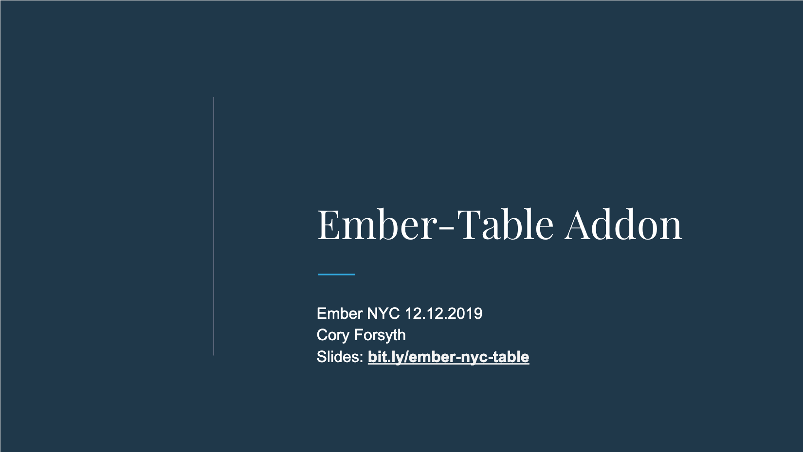

# ember-table-demo

A step-by-step demonstration of creating a simple ember-table and
progressively adding more sophisticated features.

## Installation

- Clone this repository
- `yarn install`
- `ember serve`
- Visit http://localhost:4200 or http://0.0.0.0:4200

## Ember NYC Presentation

[Slides from Ember NYC 12.12.2019](https://docs.google.com/presentation/d/1cVblQt09KmkFbXBvDrxdl072k3WG_BKOMjnlgJm_qNA/edit#slide=id.g75e8dc6961_0_0)

## Steps

Demo sites are deployed to github pages at https://bantic.github.io/ember-table-demo/index.html

- basic-table [demo](https://bantic.github.io/ember-table-demo/basic-table/) [diff](https://github.com/bantic/ember-table-demo/compare/setup...basic-table)
- random-rows [demo](https://bantic.github.io/ember-table-demo/random-rows/) [diff](https://github.com/bantic/ember-table-demo/compare/basic-table...random-rows)
- sorting [demo](https://bantic.github.io/ember-table-demo/sorting/) [diff](https://github.com/bantic/ember-table-demo/compare/random-rows...sorting)
- live-updates [demo](https://bantic.github.io/ember-table-demo/live-updates/) [diff](https://github.com/bantic/ember-table-demo/compare/sorting...live-updates)
- selection [demo](https://bantic.github.io/ember-table-demo/selection/) [diff](https://github.com/bantic/ember-table-demo/compare/live-updates...selection)
- row-colors [demo](https://bantic.github.io/ember-table-demo/row-colors/) [diff](https://github.com/bantic/ember-table-demo/compare/selection...row-colors)
  more changes
